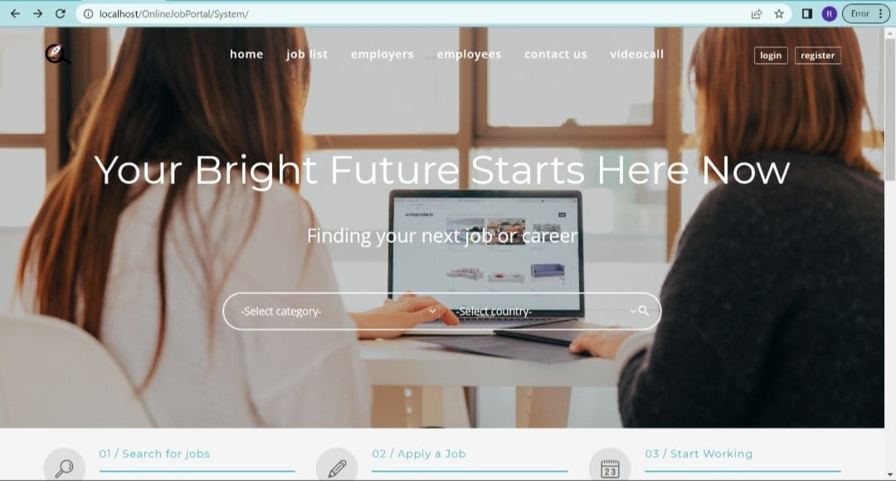
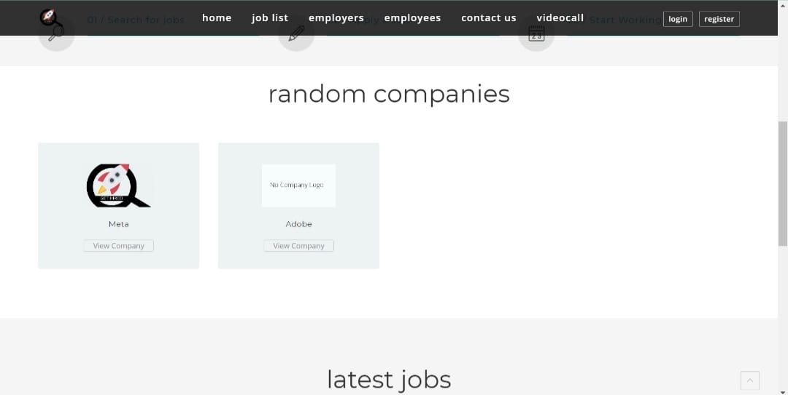
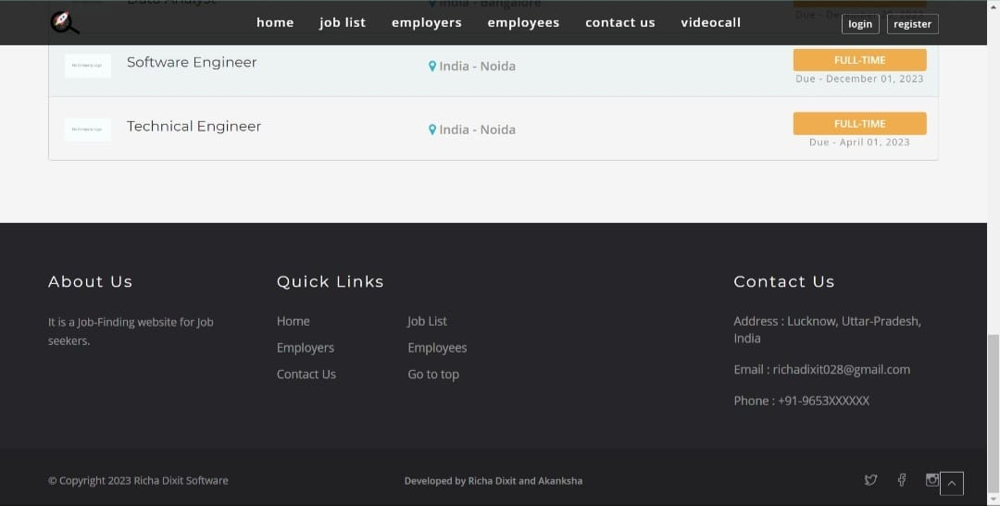
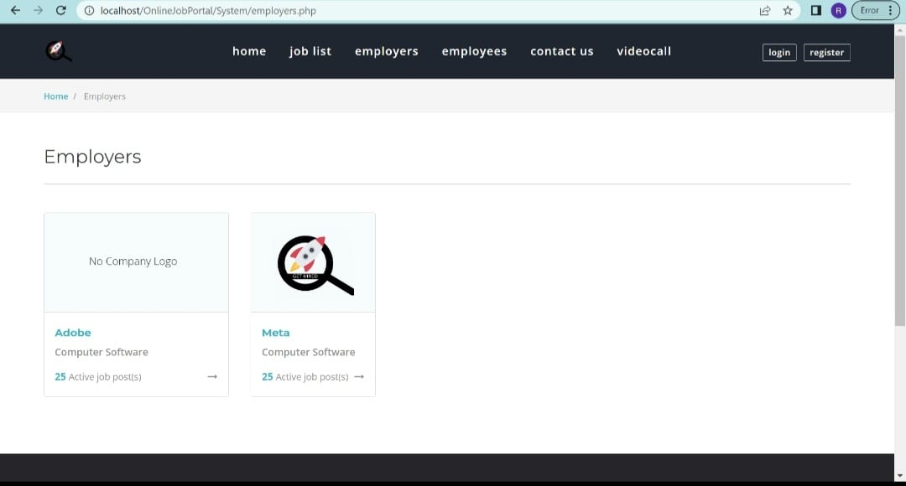
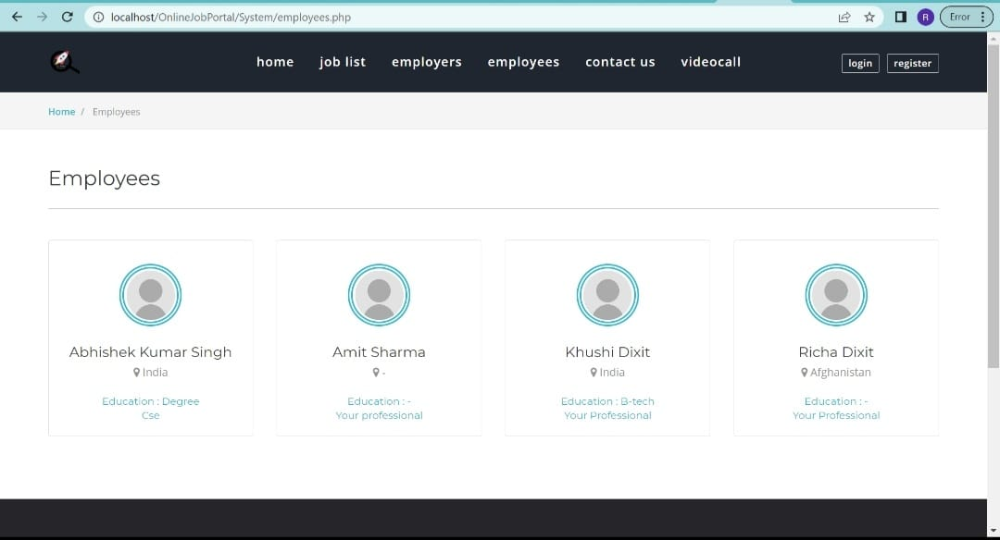
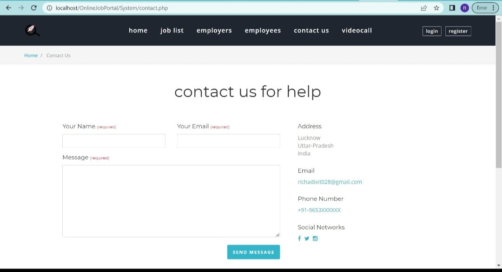
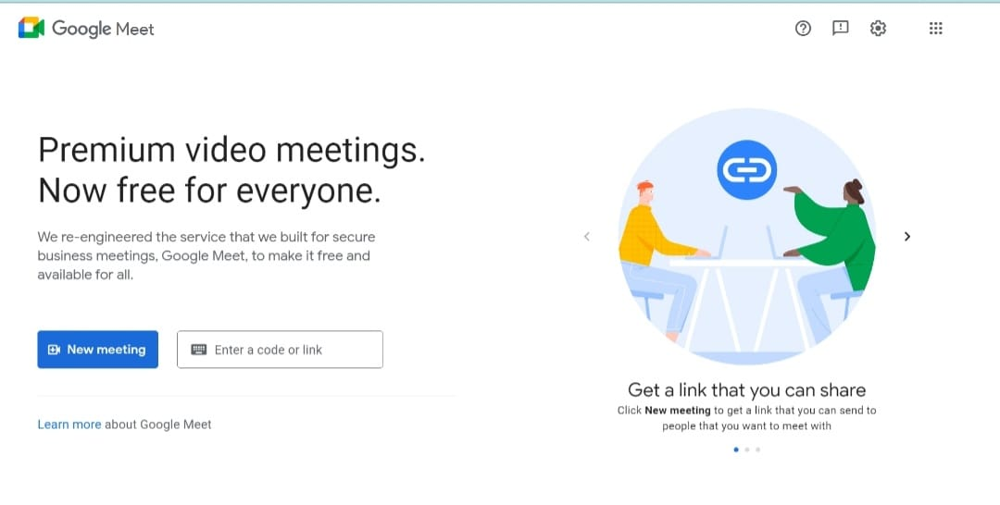

# OnlineJobPortal_

## Table of contents

* [Introduction](#introduction)

* [Features](#features)

* [Technologies](#technologies)

* [Tools](#tools)

* [Demo Screenshots](#demo-screenshots)

* [Setup](#setup)

## Introduction

This project aims to provide a platform for job seekers/Employees to find suitable employment opportunities and for employers to recruit talented candidates. With the increasing use of the internet in job search and recruitment, our project aims to make the process easier, faster, and more efficient for both job seekers and employers.

Our job portal is designed to be user-friendly, responsive, and accessible to a wide range of users. We have used a combination of front-end technologies such as HTML, CSS, and JavaScript to create an attractive and intuitive user interface. The back-end of the portal is powered by PHP and MySQL, which enables us to store and manage large amounts of data efficiently.

The project includes features such as job listings, job applications, and employer profiles. Job seekers can search for job openings based on various criteria such as location and category. Employers can post job openings and contact candidates directly through the portal.

## Features

This website has two users:

1. Employees:
  
  * Can update their profile information
  
  * Can upload profile picture and update it

  * Can search for job openings using job category, location(country name)
  
  * Can apply in any job openings which they like
  
  
2. Employers:

  * Can update their profile information
  
  * Can upload profile picture(logo) and update it
  
  * Can post job openings
  
  * Can manage job postings and applicant pool
  

  ## Technologies
  * HTML
  * Javascript
  * CSS
  * Bootstrap 
  * PHP
  * MySQL
  
  ## TOOLS
  * XAMPP Server
  * Visual Studio Code
  
  ## Demo Screenshots
  

 
 
  <h3>HOME PAGE </h3>

 

 

  
 
 
 

 

 
 
 
 

 
 
 
 
  <h3>job list </h3>

 

 

 
 
 
 
  <h3> employers </h3>

 

 

  
 <h3> employees </h3>
 
 
 
 

 
  
 <h3> contact us </h3>
 
 
 
 

 

 
  <h3> video call </h3>
  
 
 
 

 
 

 
  <h3> Log in </h3>
  
 
 
 

 
 

 
  <h3> Register </h3>
  
 
 
 

 
 ## Setup
 
It is better to use Visual Studio Code IDE (Integrated Development Environment) to run this project properly.
